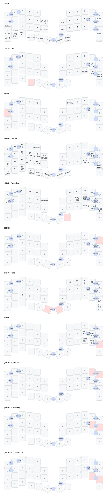

# zmk-config-roBa

## レイヤー構成

| レイヤー | 用途 | 呼び出し方法 |
| --- | --- | --- |
| default | 基本のQWERTY配列 | (常時) |
| num_arrow | 数字・矢印キー | 左下段の `mo 1` キー押しっぱなし、または右下段 `~` キー長押し |
| symbol | 記号(!@#$%など) | 左上段 `A` キー長押し |
| tenkey_excel | テンキー・Excel操作(セル移動、行末/最終行ジャンプなど) | 言語キー(タップダンス)長押し |
| MOUSE_funktion | ファンクションキー(F1-F12)・マウスクリック | 右下段 `Enter` キー長押し |
| SCROLL | トラックボールでのスクロール操作 | 右上段 `P` キー長押し |
| MOUSE | マウスボタン(クリック・戻る/進むボタン) | 右下段 `/` キー長押し |
| bluetooth | Bluetoothペアリング選択・リセット | コンボ(2キー同時押し) |
| gesture_window | トラックボールでウィンドウ移動操作 | コンボ(2キー同時押し) |
| gesture_desktop | トラックボールで仮想デスクトップ切り替え | コンボ(2キー同時押し)、または右上段でホールド |
| gesture_copypaste | トラックボールでコピー・ペースト操作 | コンボ(2キー同時押し) |

## 主なコンボ(2キー同時押し)

| 動作 | 説明 |
| --- | --- |
| Tab / Shift+Tab | 左上段2キー / 右上段2キー |
| Escape | 左上段2キー |
| Delete | 右下段2キー |
| 左クリック押しっぱなし | ドラッグ操作用 |
| bluetooth / gesture_window / gesture_desktop / gesture_copypaste レイヤー | それぞれ対応する2キー同時押し |

具体的なキーの配置は上図(SVG)、詳細な割り当ては `config/roBa.keymap` を参照してください。
